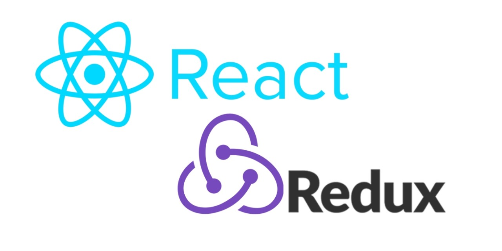

<a name="readme-top"></a>

<div align="center">

<h1><b>EDEO website</b></h1>
</div>

<!-- TABLE OF CONTENTS -->

## 📗 Table of Contents

- [📖 EDEO_website ](#EDEO_website )
  - [🛠 Built With ](#built-with)
    - [Tech Stack ](#tech-stack)
    - [Key Features ](#key-features)
  - [💻 Getting Started ](#getting-started)
    - [Prerequisites](#prerequisites)
    - [Setup](#setup)
    - [Install](#install)
    - [Usage](#usage)
  - [👥 Developer ](#developers)
  - [🔭 Future Features ](#future-features)
  - [🤝 Contributing ](#contributing)
  - [⭐️ Show your support ](#️show-your-support)
  - [🙏 Acknowledgments ](#acknowledgments)
  - [📝 License ](#license)

<!-- PROJECT DESCRIPTION -->

# 📖 EDEO website <a name="EDEO_website"></a>

<b>This is an Organization website..</b>

Empowering Communities, Solving Real-World Problems.
## 🛠 Built With <a name="built-with"></a>
<div >

</div >
<br>
<div >
</div >
<a name="tech-stack"></a>

<details>
  <summary>Server</summary>
    <li><a href="https://guides.rubyonrails.org/">Rails</a></li>
</details>

<!-- Features -->

### Comming <a name="key-features"></a>
<!-- 
- **Create Ruby on Rails App**
- **Add Linter ROR**
- **Create data model**
- **Add Request Test**
- **Add Integration Test**
 -->
<p align="right">(<a href="#readme-top">back to top</a>)</p>

<!-- GETTING STARTED -->

## 💻 Getting Started <a name="getting-started"></a>

To get a local copy up and running, follow these steps.

### Prerequisites

In order to run this project you need:

```
    NodeJS
    WebBrowser
    IDE eg: {VScode}
```

### Setup

Clone this repository to your desired folder:

```bash
  git clone https://github.com/Bluetelecast/EDEO-Website.git
```
### Install

Install this project with:

```bash
  cd  EDEO-Website

  npm install
```

### Usage

<p align="right">(<a href="#readme-top">back to top</a>)</p>

<!-- AUTHORS -->

## 👥 Developers <a name="author"></a>

👤 **Graciano**

- GitHub: [@Graciano](https://github.com/Graciano1997)

<p align="right">(<a href="#readme-top">back to top</a>)</p>

<!-- FUTURE FEATURES -->

## 🔭 Future Features <a name="future-features"></a>

- **Integrating with a Backend services**

<p align="right">(<a href="#readme-top">back to top</a>)</p>

<!-- CONTRIBUTING -->

## 🤝 Contributing <a name="contributing"></a>

Contributions, issues, and feature requests are welcome!

Feel free to check the [issues page](https://github.com/Bluetelecast/EDEO-Website/issues).

<p align="right">(<a href="#readme-top">back to top</a>)</p>

<!-- SUPPORT -->

## ⭐️ Show your support <a name="support"></a>

If you like this project you can share this project to your friend

<p align="right">(<a href="#readme-top">back to top</a>)</p>

<!-- ACKNOWLEDGEMENT -->

## 🙏 Acknowledgments <a name="acknowledgements"></a>

I would like to thank Bluetelecast and Microverse and all the future contributors for this project.

<p align="right">(<a href="#readme-top">back to top</a>)</p>

<!-- LICENSE -->

## 📝 License <a name="license"></a>

This project is [MIT](./LICENSE) licensed.

<p align="right">(<a href="#readme-top">back to top</a>)</p>
